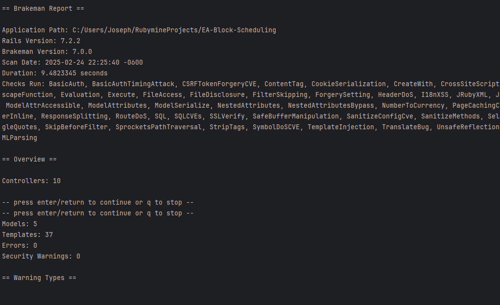

# Engineering Academy Block Schedule Generator
## Sprint 2 MVP
Deployed app: https://ea-block-scheduling-68f7266eed53.herokuapp.com/                                                                                                         
Code Climate: We are not using Code Climate as it is asking us to pay. 

Instead, we are using Rubocop and Brakeman:





## Team Work Agreement (TWA)
https://github.com/patibas-tamu/EA-Block-Scheduling/blob/main/documentation/Spring2025/Team_Working_Agreement.txt
## Important Links
+ Deployed App: https://ea-block-scheduler-4fecd886e389.herokuapp.com/
+ Code Climate: https://codeclimate.com/github/tamu-edu-students/EA-Block-Scheduling
+ Sprint 4 MVP Report: https://github.com/tamu-edu-students/EA-Block-Scheduling/blob/main/documentation/Fall2024/Sprint%204%20MVP/Sprint%204%20MVP%20Report.pdf
+ Team Working Agreements: https://github.com/tamu-edu-students/EA-Block-Scheduling/blob/main/documentation/Team%20Working%20Agreement.md

## Overview
This project provides a software solution to generate possible block schedules for the Engineering Academies (EA) across the state, starting with the Austin EA. The program creates block schedules for math, science, and engineering courses for the spring and fall semesters, ensuring that no class overlaps and prerequisites are met. The output is provided in visual formats, replacing the current manual process that relies on spreadsheets, calendars, and Google Forms.

The intended users of this solution are EA staff and students.

### Get Started
- **Ruby**: Version `3.3.4` (use a version manager like `rbenv` or `rvm` for easier setup)
- **Rails**: Version specified in `Gemfile.lock`

### Setup Instructions

1. **Clone the Repository**  
   Open a terminal and run:
   ```bash
   $git clone https://github.com/tamu-edu-students/EA-Block-Scheduling.git
   $cd EA-Block-Scheduling 

### Install Ruby and Dependencies

1. **Install Ruby Version 3.3.4 Using rbenv**  
   Ensure `rbenv` is installed on your system. Then, run the following commands to install and set the required Ruby version:

   ```bash
   $rbenv install 3.3.4
   $rbenv local 3.3.4
   $bundle install

### Deploying to Heroku

Follow these steps to deploy your application to Heroku.

1. **Login to Heroku**  
   Make sure you have the Heroku CLI installed. Log in to your Heroku account:
   ```bash
   $heroku login
   $heroku create your-app-name
   $git push heroku main
   $heroku run rails db:migrate #Run the database migrations on the Heroku server

### Create a .env File for Local Development

If running locally, create a .env file in the root of your project and add the following environment variables for SSO:
GOOGLE_CLIENT_ID=668153806127-b3n784bjqa1jh2tdnd346jis9jt9rpka.apps.googleusercontent.com <br>
GOOGLE_CLIENT_SECRET=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

### Notes

- **Set Environment Variables**  
  Make sure any required environment variables are set on Heroku using:
  ```bash
  $heroku config:set VARIABLE_NAME=value

### Tests
- **Run rspec and cucumber tests**  
  ```bash
  $bundle exec rspec
  $bundle exec cucumber

### To view admin dashboard
- **You can assign admin role to a user while running the app in local to see the admin dashboard.**
  ```bash
  $rails console
  #user = User.find_by(email: 'user@example.com')
  #user.update(role: 'admin')

### The Issue
Professor Shana Shaw has requested an application that would automate the process of creating block schedules for academy students to pick from when enrollment is in process. There are many classes that are often taken together, and often, classes that should be taken together have conflicting meeting times. This requires Professor Shaw to manually create a list of classes that can be taken together without conflict.

### The process
Before each semester's enrollment period opens, a partner college sends a list of classes to Professor Shaw in a spreadsheet format. Professor Shaw adds these classes to a form that creates a calendar with colorful blocks to show students what classes to take in order to not have time conflicts. The student chooses a block of classes, and the form is submitted to Professor Shaw who then enrolls the students into their chosen classes.

### Goal
1. The application will be accessible to currently accepted academy students.
2. The application will have a page for an admin user to upload a spreadsheet of available classes.
3. The application will be able to parse the spreadsheet uploaded by admins in order to differentiate between classes.
4. The application will provide clear block schedule charts based on the classes selected by students.

## Features
+ **Automatic Block Generation:** Generates non-overlapping block schedules for math, science, and engineering sections.
     1. Instruction to test Block generator(it is not deployed main)
     - git checkout Blockgen-Re
     - rails server
     - http://localhost:3000/blocks

+ **Prerequisite Management:** Ensures that all class prerequisites are considered when generating schedules.
+ **Support for Multiple Sections:** Accounts for multiple sections of the same class, balancing their timing and order.
+ **Spreadsheet and Visual Output:** Provides the output as a downloadable spreadsheet and a visual display for easier review and sharing.
+ **Customizable for Multiple Academies:** The software can be extended for other academies in the state.

## Technologies
+ **Backend:** Ruby on Rails (for handling business logic and data management)
+ **Database:** SQLite3 (for local development and testing), PostgreSQL (for production on Heroku)
+ **Frontend/Visualization:** HTML/CSS/JavaScript (for visual display)
+ **Data Handling:** ActiveRecord (for database operations in Rails)
+ **Spreadsheet Output:** Ruby Gems like axlsx or rubyXL (for generating Excel files)
+ **Deployment:** Heroku (for deployment and hosting)

## Contact
+ **Aaron Jones:** aaron.h.jones@tamu.edu
+ **Adithi Srinath:** adithis_197@tamu.edu
+ **Chengyan Tsai:** crescentmax@tamu.edu
+ **Junhyuk Lee:** xodn348@tamu.edu
+ **Mahima Kardam Bhatt:** mahima19@tamu.edu
+ **Ryann Lu:** lu.ryann.2n@tamu.edu
+ **William-David Vanderpuye:** wilv10@tamu.edu
